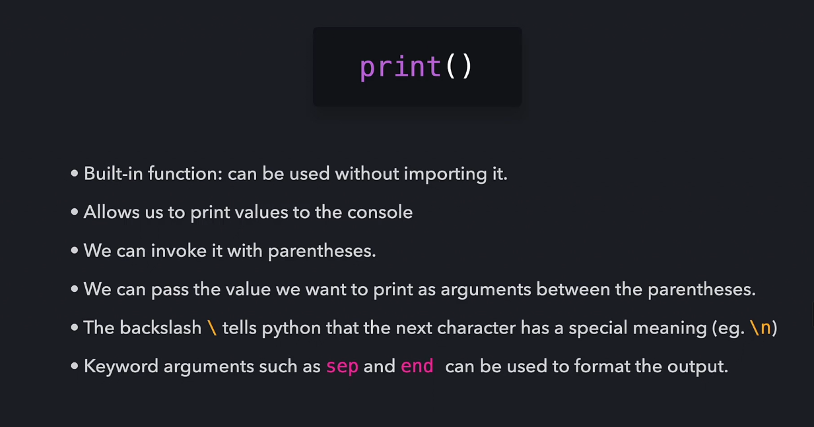
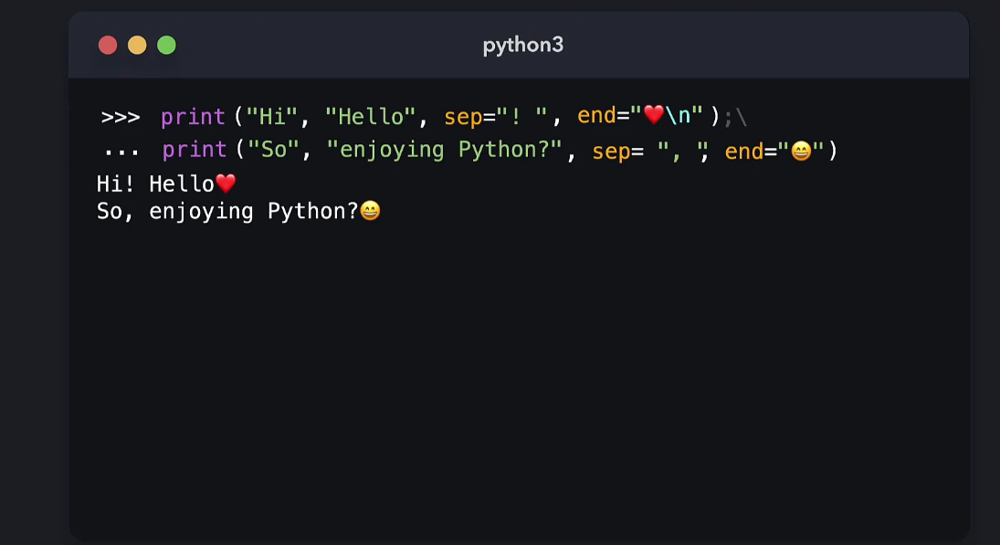
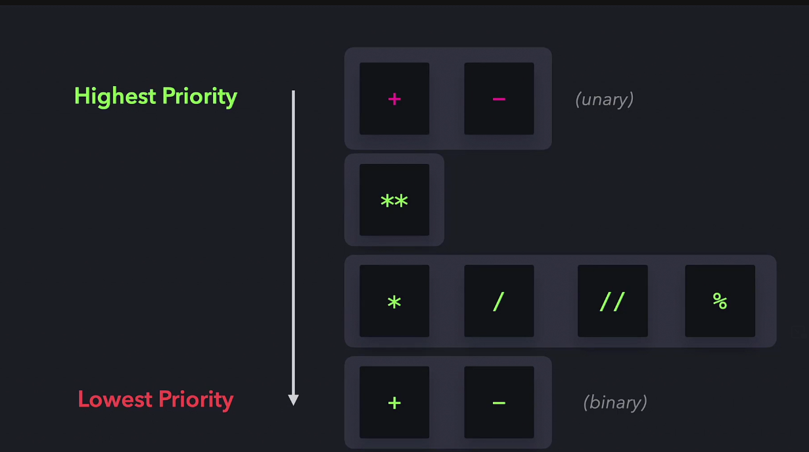
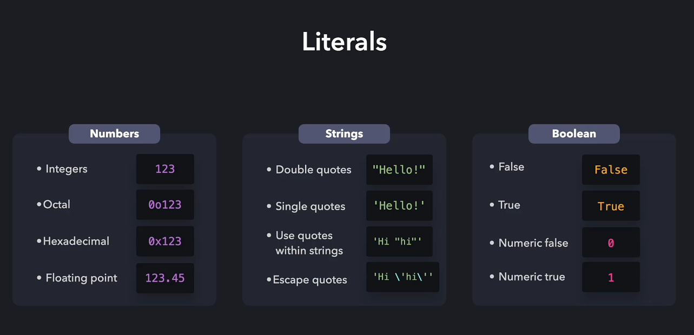
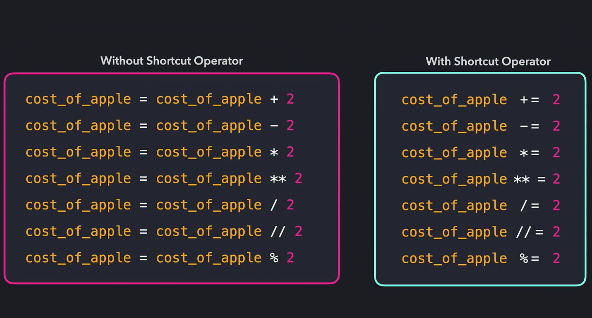

# Python

Install python to your OS. If using Linux you most likely have python installed

Type `python3` to open the shell
___

## Functions

A part of your code thats used to vause an effect or evaluate a value.

Can come from:
 - Python (built-in functions)
 - Modules
 - Your own code

The `print()` function allows you to print out values within the brackets

___

## Input

`input("")`

___

## Operators

Arithemtic Operations

 - Exponential `**`

 - Multiplication `*`

 - Division `/` - *returns a float*

 - Floor Divison `//` - *returns an int*

 - Modulo `%` - *returns remaineder*

 - Addition `+`

 - Subtraction `-` - *Unary operator*

 

___

## Comparison Operators

Comparison Operators 

- `==` - Equal to
- `!=` - Not equal to
- `>` - greater than
- `>=` - greater than or equal to
- `<` - less than
- `<=` - less than or equal to
___

# Literals

Literal types:
 1. Integers
  - Octal Numbers
  - Hexadecimal Numbers

 2. Floating Point Numbers
 3. Strings
 4. Booleans

___

## Variables

