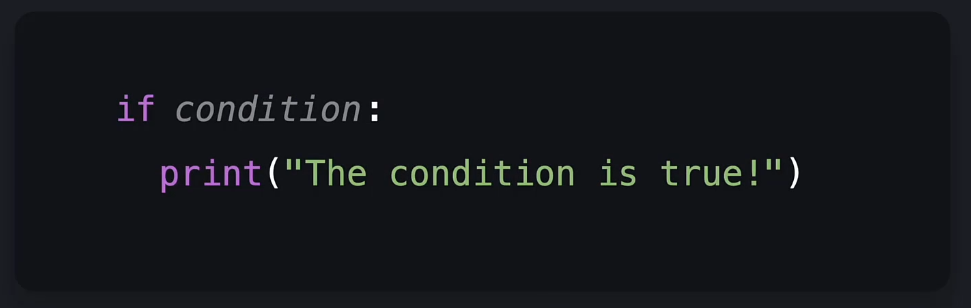
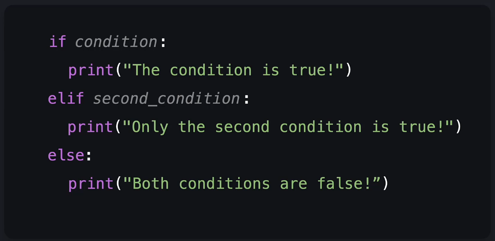
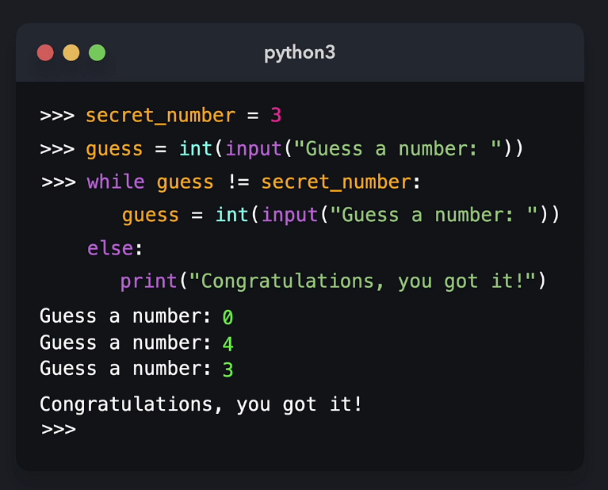
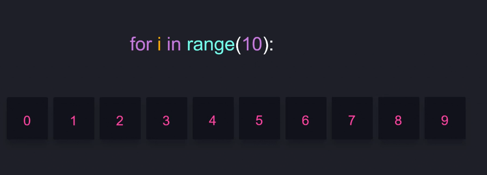

## Conditional statements

`if` - will run only if condition is met

`elif` - runs if prior condition is not met 

`else` - runs otherwise, ending if statement

## While Loops

`while condition:` - Will continue running as long as condition is met

## For Loops

`for _ in _:` - Iterates through an object

