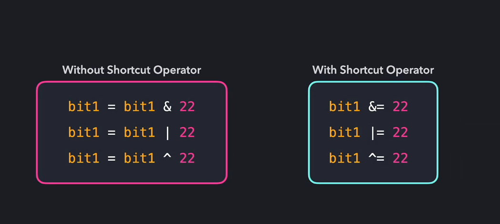
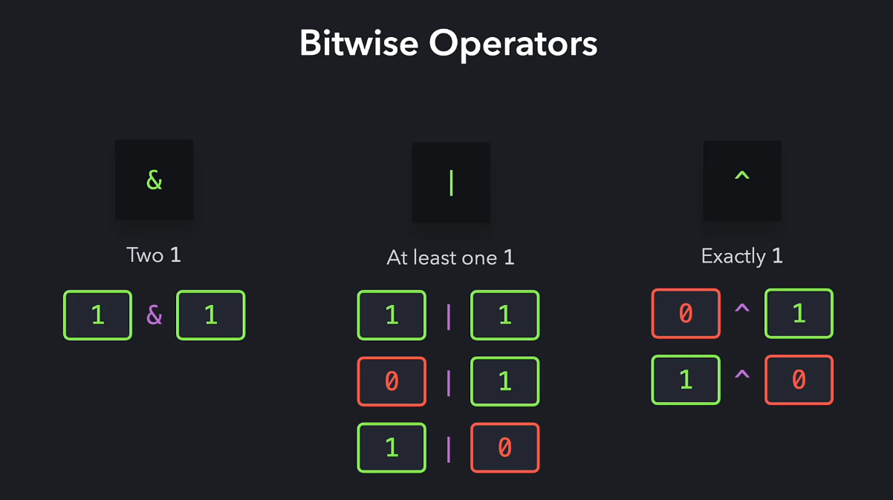
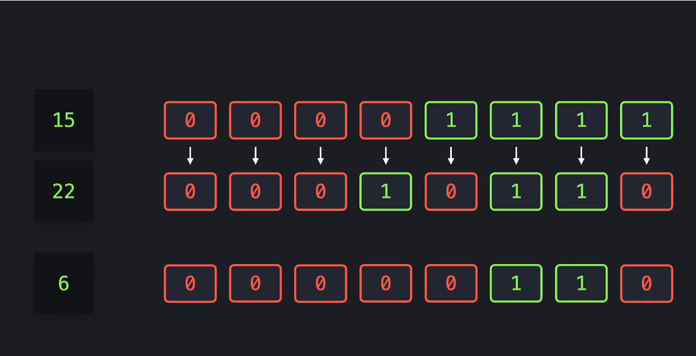
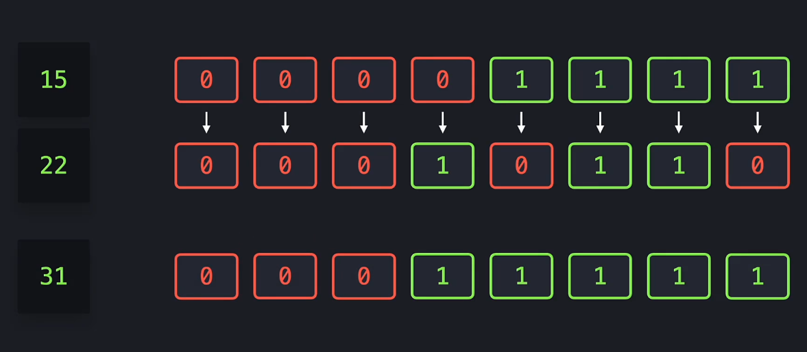
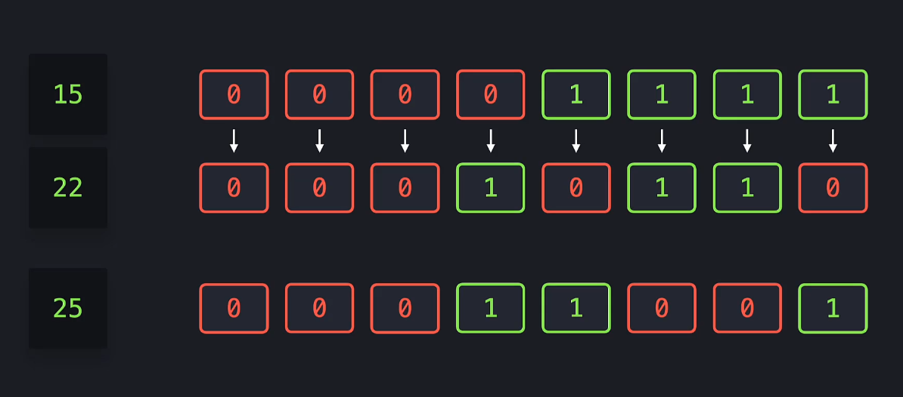
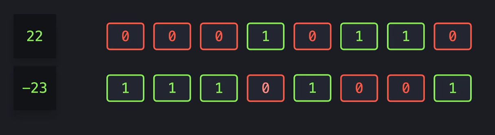
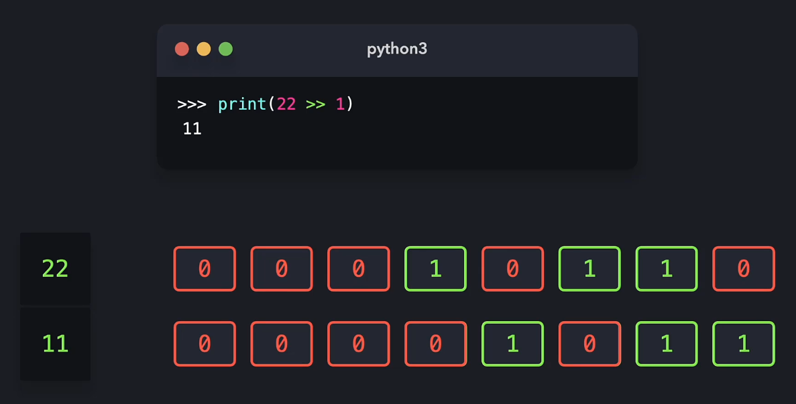
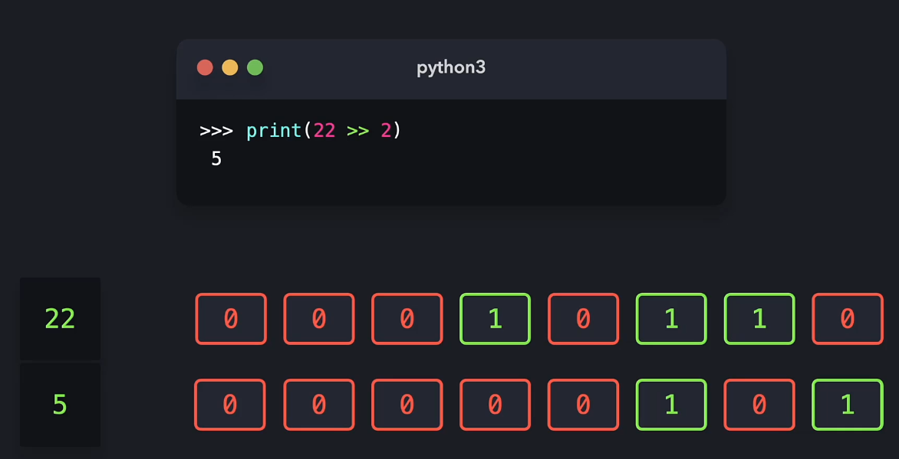

## Bitwise opeartors

- `&` - Conjunction
- `|` - Disjunction
- `~` - Negation
- `^` - Exclusive


___


___

```python 
print(15 & 22)
6
```




___

```python
print(15 | 22)
31
```



___

```python
print(15 ^ 22)
25
```



___

```python 
print(22~)
-23
```



___

### Bit shifting

 - `>>` - Shifts all the bits to the right 
 - `<<` - Shifts all the bits to the left 

 

 

