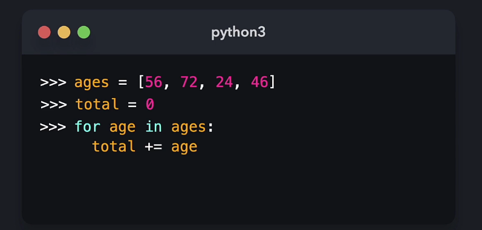
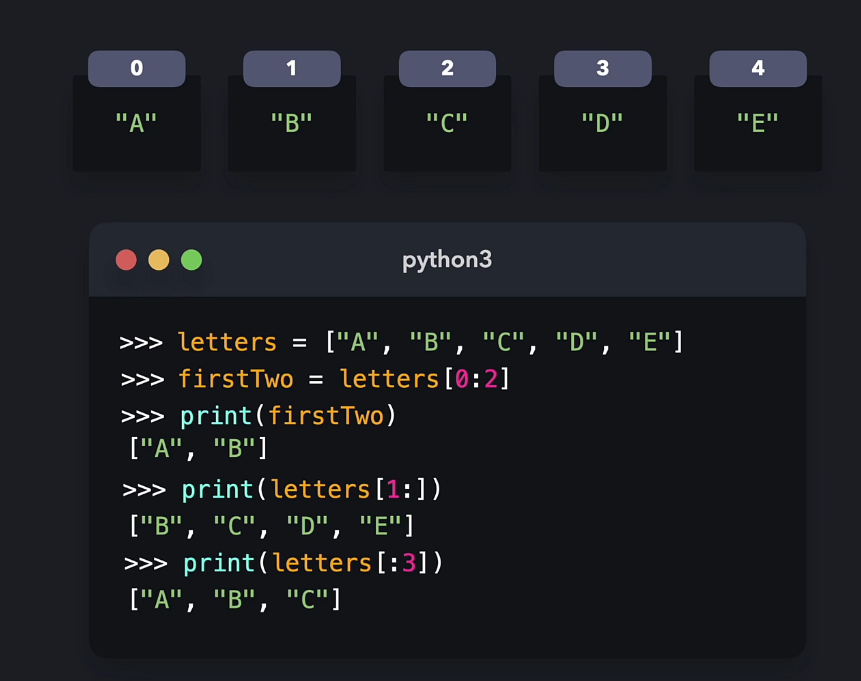

# Lists

You can define a list with `[]`. For example `food = []`

You can index a list by using the name of the list and a number in brackets. `food[2]`, `food[0]`. `food[3]`
Note: Remember that 1 is not the beginning of the index

## List methods

- `food.append` - allows you to append a value to the end of the list
- `food.insert` - inserts a given value at a specific index point
- `food.sort` - sorts from lowest value to highest value
- `food.reverse` - reverses the list

## Iterating through lists

In this snippet the value total increases by each age as the for loop iterates through ages list.

## Slicing lists

`lists[start:end]`

